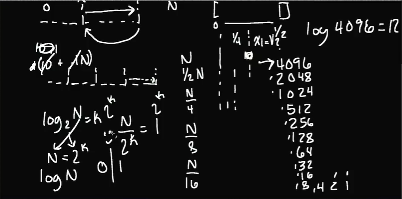

# search

## linear search ( O(N) time complexity)
```typescript
export default function linear_search(haystack: number[], needle: number): boolean {
  for (let i =0; i < haystack.length;++i){
	  if (haystack[i] === needle){
		  return true;
	  }
  }
  return false;
}

```

## binary search algorithm

- Binary search is a search algorithm used to find the position of a target value within a sorted array. It works by repeatedly dividing the search interval in half until the target value is found or the interval is empty. The search interval is halved by comparing the target element with the middle value of the search space.
- Time Complexity: O(log N)


